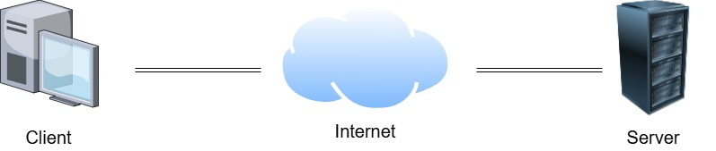
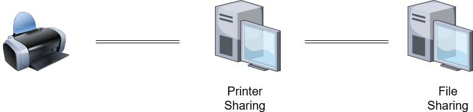

# Server and Client

### Difference Between Server and Client

On the Internet, all devices that communicate over the network are called **hosts**. 

Computers have differente roles. A computer can act as either a server or a client.

A **server** is a computer that **provides data or services**. All destinations you access online is delievered by servers connected to the Internet.

A **client** is a computer that **requests data or services**. For instance, a web browser is a client, because you use it to access websites.

### P2P Networks

In small offices and home offices (SOHO), computers can act as both a server and a client at the same time. This type of network is called **peer-to-peer** (P2P) network.

The simplest P2P network consists of computers connected directly. Both computers can provide and request data or services, acting as either a service or a client as needed.

More computers can be connected to a P2P network, but a network device called *switch* is required to connect all of them.

A P2P environment has some disadvantages. For example, the performance of a computer acting as both a server and a client can be significantly reduced. 

Large companies tipacally use dedicated servers to handle a high number of requests.

Advantages of a P2P network:
- Easy to configure.
- Low complexity.
- Lower cost, as network devices and dedicated servers may not be necessary.
- Can be used to simple tasks such as file sharing and printer sharing.

Disadvantages:
- Not centralized managment.
- Low level of security.
- Not scalable.
- Performance can be significantly reduced, since all devices may act as both servers and clients