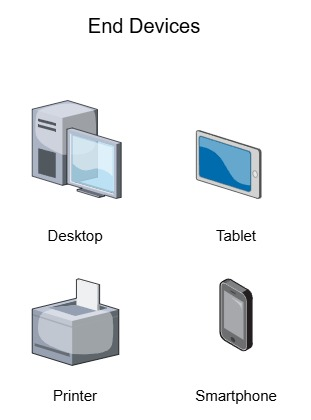

# Network Components

The path that data takes from its source to its destination can be as simple as a single cable connecting two computers, or as complex as a network spanning the globe.

Network infrastructure consists of three categories of components:

- End devices
- Intermediate devices
- Network media 

Devices and network media are the physical elements of a network, usually referred as **network hardware**. The hardware is typically consists of the visible components of a network infrastructure, such as laptops, PCs, switches, routers, wireless access points, and cables used to connect devices.

However, some components are not always visible. For example, wireless devices transmitt messages through the air using invisible radio or infrared waves.

### End Devices

Network devices that most people are familiar with are called **end devices**. They form the interface between users and network services.

A end device is either the source or the destination of a message transmitted over the network. To uniquely identify hosts, addresses are used. When a host initiates communication, it uses the destination address to specify where the message should be sent.